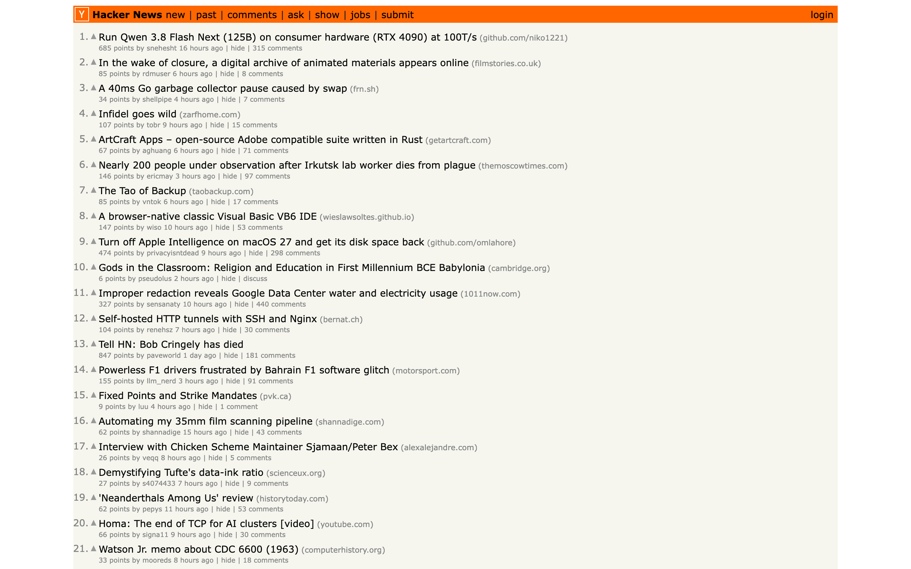
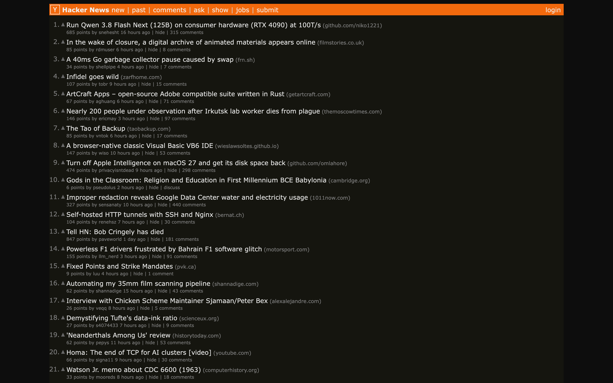
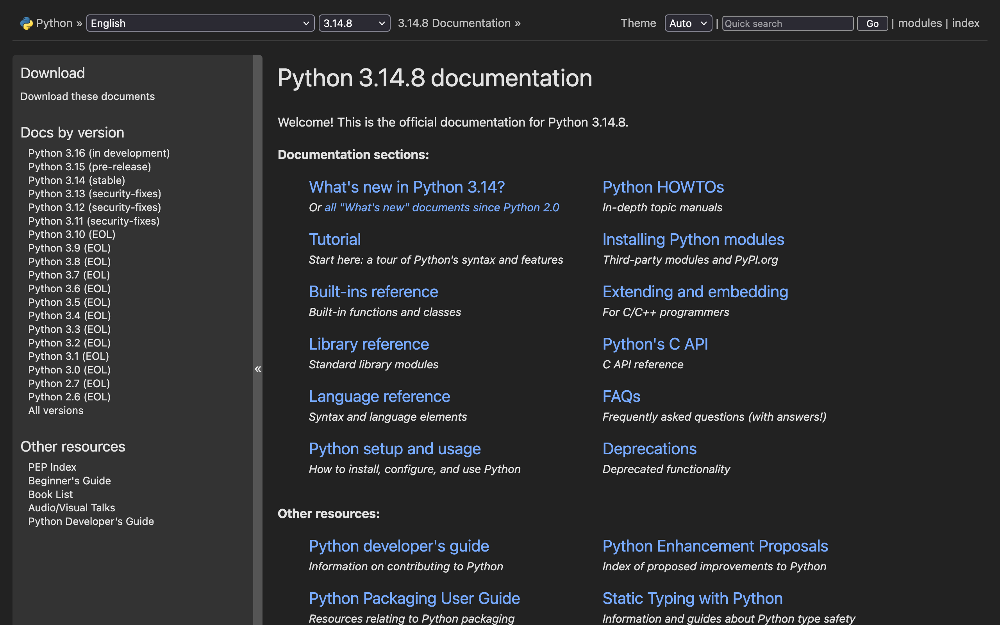
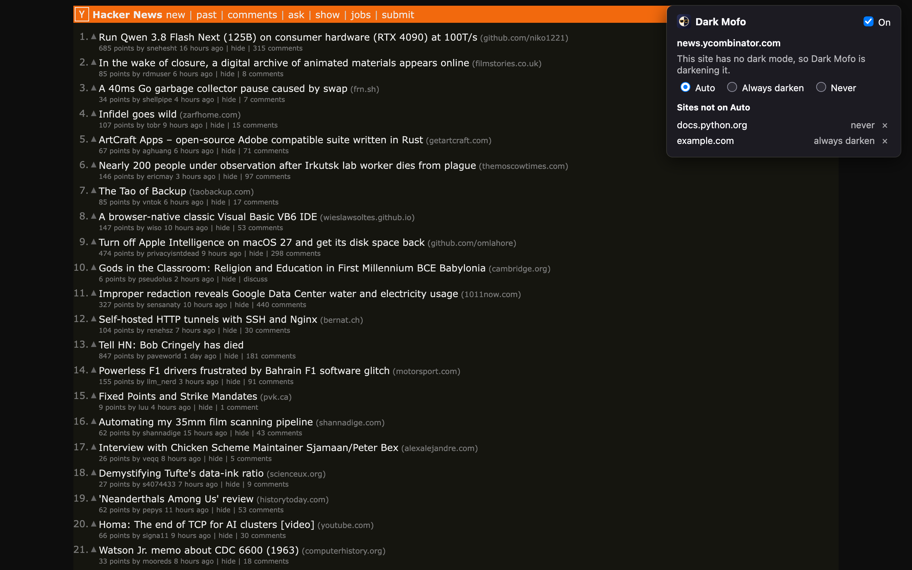

# Dark Mofo

## What it is

Dark Mofo is a Firefox extension that keeps every website in the colour scheme Firefox asks for. Firefox tells sites whether to be light or dark, following its theme or macOS. Plenty of sites ignore that and stay white. Dark Mofo checks each page and only steps in when one stays light while you are in dark mode.

- Sites that have their own dark mode keep it. This includes sites that switch themes after loading; Dark Mofo notices and backs off.
- Light-only sites are darkened by inverting the page and flipping images, video and embeds back, so photos look normal and link colours keep their hue.
- In light mode, Dark Mofo does nothing. Sites that are always dark are left dark.
- Dark Mofo remembers which sites it darkened, so on the next visit they open dark without a white flash.

With Firefox in dark mode, a light-only site such as Hacker News stays white on its own (left). Dark Mofo darkens it, keeping the orange header orange (right):

  
  

The Python docs have their own dark theme, so Dark Mofo leaves them alone:

The toolbar popup says what it is doing on the current site, sets the site to **Auto**, **Always darken** or **Never**, and lists the sites you have set. Its switch turns Dark Mofo off everywhere:

It pairs with [flatty-mofo](https://github.com/kartikthapar/flatty-mofo), which darkens Firefox's own toolbars and tabs.

## Instructions

1. Install Dark Mofo from [Firefox Add-ons](https://addons.mozilla.org/firefox/addon/dark-mofo/) and accept the prompt. If Firefox asks, allow it on all websites; the toolbar popup also has an **Allow** button.
2. Pin the Dark Mofo button to the toolbar from the puzzle-piece menu.
3. Put Firefox in dark mode, through its theme or macOS appearance. Light-only sites are darkened from then on; use the toolbar button to change how a site is treated.

To work on Dark Mofo, load `extension/manifest.json` with **Load Temporary Add-on…** in `about:debugging#/runtime/this-firefox`, and run the tests with `npm --prefix test install && node test/run.mjs`.
